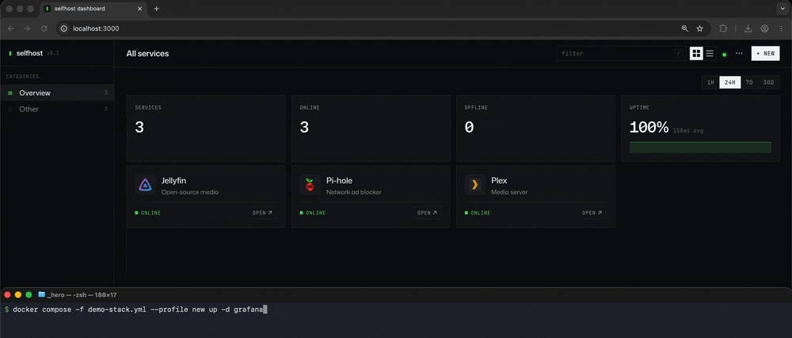

<div align="center">

# 🐳 selfhost-dashboard

**A beautiful, fast homelab dashboard that auto-discovers your Docker containers.**

[](https://github.com/wrnbenji/selfhost-dashboard/actions/workflows/docker.yml)
[](https://github.com/wrnbenji/selfhost-dashboard/pkgs/container/selfhost-dashboard)
[](LICENSE)
[](https://github.com/wrnbenji/selfhost-dashboard/stargazers)

<!-- Capture a short demo (see docs/HERO.md), drop it in, and uncomment:

-->

[Quick start](#-quick-start) • [Features](#-features) • [Configuration](#️-configuration) • [Roadmap](#-roadmap) • [Contributing](#-contributing)

</div>

---

> **Status:** v0.1 — designed to run on your LAN or behind a reverse proxy. No built-in auth yet (planned for v0.2).

Tired of bookmarking every self-hosted service and editing a config file every time something changes? **selfhost-dashboard** reads the labels off your Docker containers and builds the dashboard for you — then watches each service's health in real time.

```bash
docker run -d -p 3000:3000 \
  -v /var/run/docker.sock:/var/run/docker.sock:ro \
  -v $(pwd)/data:/data \
  ghcr.io/wrnbenji/selfhost-dashboard
```

Open <http://localhost:3000>. That's it.

---

## ✨ Features

- 🔍 **Zero-config discovery** — label a container, the card appears within 30s
- 📡 **Real-time health** — HTTP probes pushed live over SSE, no refresh
- 📊 **Uptime & latency history** — per-service timeline, incidents, p95 latency
- ✋ **Drag & drop** reordering · 🌙 **dark mode** · 📄 optional **YAML config**
- 📦 **Single image**, one SQLite file — no external database, no dependencies

<details>
<summary>🔍 <strong>How auto-discovery works</strong></summary>

<br>

The backend reads the Docker socket (read-only) and watches for containers
labeled `dashboard.enable=true`. Add/remove the label and the card appears or
disappears automatically — no restart, no config edit. See
[Docker label discovery](#docker-label-discovery).

</details>

<details>
<summary>📊 <strong>What it monitors</strong></summary>

<br>

- Online/offline status via HTTP `HEAD`/`GET` probes (5s timeout)
- Average + p95 latency, uptime %, incident count per window (1h / 24h / 7d / 30d)
- A coverage indicator that distinguishes "service was down" from "the monitor wasn't running"

</details>

---

## 🚀 Quick start

**1. Run it**

```bash
docker run -d \
  --name selfhost-dashboard \
  -p 3000:3000 \
  -v /var/run/docker.sock:/var/run/docker.sock:ro \
  -v $(pwd)/data:/data \
  ghcr.io/wrnbenji/selfhost-dashboard:latest
```

Or with Compose — copy [`docker-compose.yml`](docker-compose.yml) and run `docker compose up -d`.

**2. Label your services**

```yaml
labels:
  - "dashboard.enable=true"
  - "dashboard.name=Plex"
  - "dashboard.url=http://192.168.1.100:32400"
  - "dashboard.icon=plex"            # optional
  - "dashboard.description=Media"    # optional
```

**3. Open the dashboard** at <http://localhost:3000> — your services are already there.

### Docker label discovery

Labeled containers appear automatically within 30 seconds; removing the label removes the card. No restart needed.

### YAML config (optional)

Prefer a file? Mount `services.yaml` at `/app/services.yaml`:

```yaml
services:
  - name: Plex
    url: http://192.168.1.100:32400
  - name: Grafana
    url: http://192.168.1.100:3000
```

Hot-reloaded on save. See [`services.example.yaml`](services.example.yaml).

---

## ⚙️ Configuration

| Env var | Default | Purpose |
|---------|---------|---------|
| `PORT` | `3000` | HTTP port |
| `DB_PATH` | `/data/dashboard.db` | SQLite location |
| `YAML_PATH` | `/app/services.yaml` | Optional YAML config |
| `DOCKER_SOCKET` | `/var/run/docker.sock` | Docker socket path |
| `HEALTH_INTERVAL_MS` | `30000` | Health check cadence |
| `DISCOVERY_INTERVAL_MS` | `30000` | Docker label rescan cadence |
| `CORS_ORIGIN` | `*` | Restrict cross-origin API callers |

---

## 🆚 Comparison

| | selfhost-dashboard | Homer | Heimdall | Homarr |
|---|:---:|:---:|:---:|:---:|
| Auto-discovery | ✅ | ❌ | ❌ | ✅ |
| Real-time health | ✅ | ❌ | ❌ | ✅ |
| Single binary image | ✅ | ✅ | ❌ | ❌ |
| Drag & drop | ✅ | ❌ | ✅ | ✅ |
| Zero external deps | ✅ | ✅ | ❌ | ❌ |

---

## 🛠 Local development

Requires Node 20+.

```bash
npm install
npm run dev    # backend :3001 + frontend :3000 (Vite proxies /api)
```

Production bundle (frontend → `backend/public/`, backend → `backend/dist/`):

```bash
npm run build
npm start      # serves API + UI on :3001
npm run test --workspace=backend   # 42 tests
```

**Stack:** Node + [Hono](https://hono.dev) · better-sqlite3 · React + Vite · Tailwind.

---

## 🗺 Roadmap

- [x] Auto-discovery, real-time health, uptime history
- [x] Drag & drop, dark mode, YAML config, responsive layout
- [ ] Authentication (Basic / OAuth2 proxy)
- [ ] Notifications (Telegram / Discord / email on downtime)
- [ ] Widgets (weather, RSS, Grafana embeds)
- [ ] Kubernetes ingress discovery

---

## 🤝 Contributing

Issues and PRs welcome — it's early days. See [Local development](#-local-development), and please run `npm run test --workspace=backend` before opening a PR.

---

## 📄 License

[MIT](LICENSE) © 2026 Benjamin Waron

---

<div align="center">

If selfhost-dashboard is useful to you, a ⭐ helps others find it.

[](https://star-history.com/#wrnbenji/selfhost-dashboard&Date)

</div>
